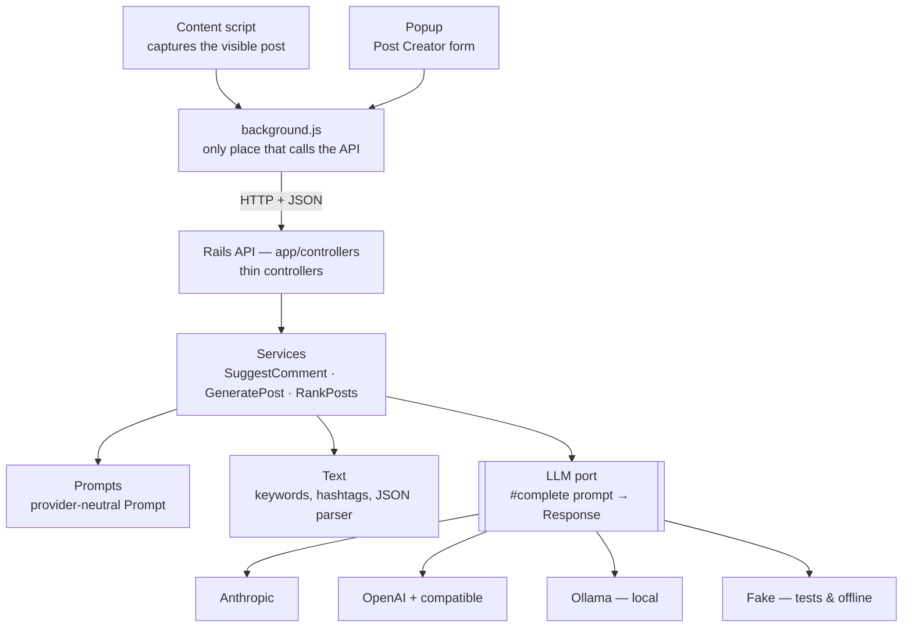

# LinkedIn Poster

An assistant that helps you stay visible on LinkedIn while job hunting:

- **Feed Collector (Chrome extension)** — reads the post you're looking at and suggests a thoughtful comment.
- **Post Creator (extension popup)** — you write what you want to say in your own words; it returns a post
  built for engagement (hook, closing question), alternative opening lines, hashtags and a live engagement checklist.
- **Job-focused ranking** — finds the feed posts about the jobs you want to apply for (e.g. UI/UX Design, Co-op, Developer) and puts hiring posts first.

**You always review before publishing.** The tool suggests; it never posts on your behalf.
Why: see [ADR-0001](docs/adr/0001-ruby-core-with-ports-and-adapters.md).

Project status and next steps: [ROADMAP](docs/ROADMAP.md). What changed in each step, file by file: [CHANGELOG](docs/CHANGELOG.md).

## Architecture



This is a **ports & adapters** (hexagonal) design. Dependencies only point inward:
`controllers → services → (prompts, text, LLM port) → domain`. The domain depends on nothing.

- Switching AI providers = changing `LLM_PROVIDER` in `.env`. No service code changes.
- The core (`lib/linkedin_poster`) is plain Ruby — no Rails, no gems — so its tests run in milliseconds
  without network access. Rails is only the HTTP layer ([ADR-0002](docs/adr/0002-rails-as-the-http-layer.md)).
- The API key lives only on the server, never in the browser extension.

## Getting started

### With Docker (recommended)

```bash
cp .env.example .env                              # start with LLM_PROVIDER=fake
cp config/profile.example.yml config/profile.yml  # your target jobs, keywords and tone
docker compose build                               # installs Ruby, Rails and gems
docker compose run --rm api bundle exec rake test  # core + API tests
docker compose up                                  # API on localhost:9292
bash bin/smoke                                     # hit all endpoints (run on your host)
```

### Without Docker

```bash
bundle install
cp .env.example .env
cp config/profile.example.yml config/profile.yml
bundle exec rake test
bin/rails server -p 9292
```

### Your profile: target jobs

`config/profile.yml` tells the ranking which jobs you're after. Each target lists the words recruiters
actually use for it:

```yaml
job_targets:
  - name: UI/UX Design
    terms: [ui/ux, ux designer, ui designer, product designer, ux engineer]
  - name: Co-op
    terms: [coop, internship, intern, work term, estágio]
```

Scoring: **+3** per target mentioned, **+5** when it is also a hiring post ("we're hiring", "apply now",
"vaga"...), **+1** per profile keyword. A hiring post for a role you don't target scores nothing.

### Choosing an AI provider

| `LLM_PROVIDER` | Needs | Good for |
| --- | --- | --- |
| `fake` | nothing | tests and offline development (responses tagged `[offline]`) |
| `ollama` | a local model (`docker compose --profile ollama up -d`, then `docker compose exec ollama ollama pull llama3.1`, and `OLLAMA_URL=http://ollama:11434`) | real AI output, free, works offline after the download |
| `anthropic` | `ANTHROPIC_API_KEY` | best comment quality (default) |
| `openai` | `OPENAI_API_KEY`, `OPENAI_MODEL` (and `OPENAI_BASE_URL` for any OpenAI-compatible API) | alternative provider |

### Tuning prompts with the Prompt Lab

`bin/prompt-lab` runs a fixed set of realistic posts (`prompt_lab/comments.yml`, `prompt_lab/posts.yml`)
through the configured AI, checks every answer against the prompt's rules (length, no hashtags, no links,
no empty praise, ignores prompt injection...) and saves a report to `prompt_lab/runs/`.

```bash
docker compose exec api bin/prompt-lab            # comment prompt
docker compose exec api bin/prompt-lab posts      # post prompt
docker compose exec api bin/prompt-lab comments hiring   # only matching cases
```

Loop: run → read the answers → change ONE thing in `lib/linkedin_poster/prompts/*` → bump its `VERSION` →
run again → compare reports. When a real post gets a bad suggestion, add it as a new case.

### Trying the extension without LinkedIn

With the API running, open **http://localhost:9292/dev/feed**: fake posts with LinkedIn's markup, where
the real `content.js` runs and calls your local AI. Available in development only.

### Loading the extension

`chrome://extensions` → enable **Developer mode** → **Load unpacked** → select the `extension/` folder.
After changing the code, click ↻ on the extension card and reload the LinkedIn tab.
Don't use **Pack extension**: it's only for distribution and creates a private key (`*.pem`, git-ignored).
With the API running on `localhost:9292`:

- In the LinkedIn feed, each post gets a **Suggest comment** button.
- Click the extension icon to open the **Post Creator** popup.

If the button doesn't show up, LinkedIn probably changed its HTML: open the feed, press F12 and run
`document.querySelectorAll('[role="listitem"][componentkey^="update-card"]').length`. If it's 0, update
`extension/selectors.js`.

## API

| Method | Path | Body | Returns |
| --- | --- | --- | --- |
| GET | `/health` | — | `{ ok, provider }` |
| POST | `/comments/suggest` | `{ post: { text, author?, url? } }` | `{ text, angle, provider }` |
| POST | `/posts/generate` | `{ brief: { idea?, goal?, topics[]?, audience?, tone? } }` (idea or goal) | `{ body, hashtags[], hooks[], checks[], full_text, provider }` |
| POST | `/posts/check` | `{ body, hashtags[] }` | `[{ id, label, passed, tip }]` — engagement checklist, no AI |
| POST | `/posts/rank` | `{ posts: [{ text, ... }], limit? }` | `[{ post, score, job_opening, matched_targets, matched_keywords, reason }]` |

Errors: `422` invalid input · `429` AI rate limit · `502` AI provider error.

## Project layout

```
lib/linkedin_poster/       The core — plain Ruby, framework-free
  domain/                  Immutable value objects (Data.define) with validation
  llm/                     The LLM port and its adapters — the only code that knows AI providers
  text/                    Pure functions: keywords, hashtags, language, engagement checklist, JSON parsing
  prompts/                 Builders that turn domain objects into a provider-neutral Prompt
  services/                Use cases: SuggestComment, GeneratePost, RankPosts
app/controllers/           Thin Rails controllers
config/initializers/       linkedin_poster.rb — the composition root that picks the AI and profile
extension/                 Chrome MV3: background.js (API), content.js (feed), popup.* (Post Creator)
test/                      Minitest — core unit tests + Rails integration tests (Fake adapter)
bin/smoke                  End-to-end check of every endpoint
bin/prompt-lab             Prompt evaluation against the configured AI (cases in prompt_lab/)
```

## Adding a new AI provider

1. Create `lib/linkedin_poster/llm/adapters/my_ai.rb` inheriting from `Base`.
2. Implement `provider_name`, `endpoint`, `headers`, `build_body(prompt)` and `extract_text(json)`.
3. Register it in `llm/registry.rb` and `require` it in `lib/linkedin_poster.rb`.
4. Add a test that does `include LLMContract` — if it passes, the rest of the system works.
5. Set `LLM_PROVIDER=my_ai`. No service changes.

## Tech stack

Ruby 3.3 · Rails 8 (API only) · Puma · Minitest · Docker · Chrome Extension (Manifest V3)
